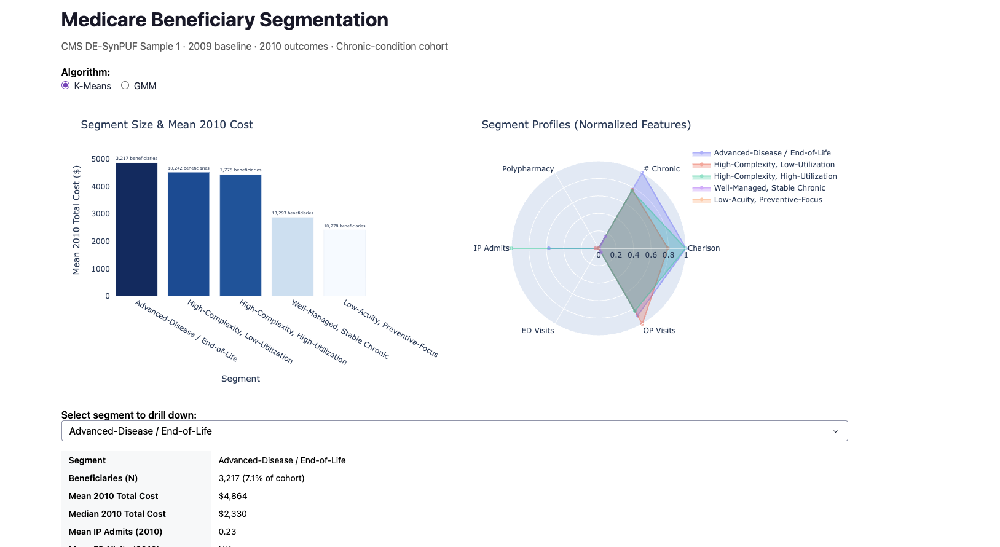

# Medicare Patient Segmentation (CMS DE-SynPUF)

> **Synthetic data only.** This project uses CMS DE-SynPUF, which is fully synthetic and not clinically actionable. Portfolio and methodological demonstration only.

[](https://github.com/shirish1357/patientsegmentation/actions/workflows/ci.yml)

---

## The Question

Among Medicare fee-for-service beneficiaries with chronic conditions, which patient segments drive disproportionate cost and utilization, and how should a health system prioritize them for care management outreach?

Patient segmentation is a foundational tool in population health. Rather than treating all high-need patients identically, it surfaces distinct subgroups with their own clinical profiles, cost trajectories, and likely responses to intervention. The goal was to build a pipeline rigorous enough for a real health system context, using a publicly available Medicare synthetic dataset.

---

## Key Results

**Cohort:** 45,305 Medicare fee-for-service beneficiaries with at least one chronic condition (2009 baseline, 2010 outcomes).

**Algorithm:** K-Means, K=5, chosen over GMM on stability grounds.

| Segment | N | Share | Mean 2010 Cost | Jaccard | Stability |
|---|---|---|---|---|---|
| Low-Acuity Preventive-Focus | 10,778 | 23.8% | $2,415 | 0.81 | Stable |
| High-Complexity High-Utilization | 7,775 | 17.2% | $4,434 | 0.76 | Stable |
| High-Complexity Low-Utilization | 10,242 | 22.6% | $4,522 | 0.79 | Stable |
| Well-Managed Stable Chronic | 13,293 | 29.3% | $2,873 | 0.77 | Stable |
| Advanced-Disease / End-of-Life | 3,217 | 7.1% | $4,864 | 0.58 | Unstable |

The smallest segment (Advanced-Disease, 7%) carries the highest per-member cost and the lowest stability score, which makes clinical sense: end-of-life trajectories are genuinely heterogeneous and hard to replicate across subsamples. The two largest segments together represent 53% of the cohort at well below average cost, which confirms that most chronic-disease beneficiaries are not high-need.



See `briefing/exec_briefing.qmd` for the full executive briefing (render with `quarto render briefing/exec_briefing.qmd`).

---

## Repository Structure

```
patientsegmentation/
├── .github/workflows/ci.yml   # GitHub Actions: lint + test on push/PR
├── src/patientseg/
│   ├── io.py                  # CSV to Parquet ingestion
│   ├── cohort.py              # cohort inclusion/exclusion with attrition table
│   ├── features.py            # feature engineering (2009 baseline)
│   ├── charlson.py            # Quan ICD-9 Charlson Comorbidity Index
│   ├── cluster.py             # K-Means + GMM sweep, K selection, comparison
│   ├── stability.py           # Hennig-style Jaccard stability validation
│   ├── profile.py             # segment profiling tables
│   └── prioritize.py          # cost x modifiability outreach framework
├── notebooks/
│   └── 01_pipeline.ipynb      # end-to-end reproducible analysis
├── briefing/
│   └── exec_briefing.qmd      # Quarto source for executive PDF
├── dashboard/
│   └── app.py                 # Plotly Dash interactive dashboard
├── scripts/
│   └── download_data.py       # downloads DE-SynPUF Sample 1 from CMS
└── tests/
    ├── test_cohort.py
    ├── test_features.py
    └── test_stability.py
```

---

## Methodology

### Data

CMS DE-SynPUF (Data Entrepreneurs' Synthetic Public Use File), Sample 1, 2008-2010. Freely available, no data use agreement required. It preserves realistic statistical distributions of Medicare claims while containing no real patient data, which makes it the standard public dataset for Medicare methods development.

Files used: Beneficiary Summary File (BSF) 2009 and 2010, Inpatient claims, Outpatient claims, and Carrier (physician/supplier) claims for 2008-2010.

**Why 2009 features and 2010 outcomes?**

Clustering on the same year's cost would be circular: a beneficiary's utilization in a year is part of what drives cost in that year. Building features from 2009 and validating segment cost differences against 2010 asks whether the segments predict *future* cost, which is the actual question for care management targeting.

### Cohort Definition

Inclusion criteria, applied in order:

1. **Continuous Part A + Part B in 2009** (12/12 months). Partial-year enrollment makes annualized cost comparisons invalid.
2. **No HMO enrollment in 2009.** HMO beneficiaries have incomplete fee-for-service claims, so their utilization would be severely undercounted.
3. **Inner join to 2010 BSF.** Ensures each beneficiary is observable in the outcome year.
4. **Continuous Part A + Part B in 2010** (12/12 months). Same reason as #1.
5. **No HMO enrollment in 2010.** Same reason as #2.
6. **Alive at 2010-01-01.** Decedents during the baseline year are a separate clinical population and cannot be managed prospectively.
7. **At least one CCW chronic condition flag in 2009.** Scopes the cohort to the population care management programs are designed for.

### Feature Engineering

All features come from the 2009 baseline window. Outcome data (2010 cost) is held out entirely from the clustering step and used only for post-hoc profiling and validation.

**Clinical complexity**
- 11 CCW chronic-condition flags (Alzheimer's, CHF, CKD, cancer, COPD, depression, diabetes, ischemic heart disease, osteoporosis, RA/OA, stroke/TIA), recoded to 0/1
- Total chronic condition count
- Charlson Comorbidity Index derived from ICD-9 diagnosis codes across inpatient, outpatient, and carrier claims (Quan 2005 mapping)
- Polypharmacy proxy: unique drug NDC count from Part D claims
- ESRD indicator

The Charlson index adds information the CCW flags miss. CCW flags are binary presence/absence. The CCI uses actual diagnosis codes to weight severity: a beneficiary with diabetes plus renal complications scores higher than one with uncomplicated diabetes, even though both have the CCW diabetes flag. That distinction matters for segmentation.

**Prior-year utilization**
- Inpatient admissions and total inpatient days
- ED visits (identified via CMS revenue center codes 450-459 and 981 in outpatient claims)
- Outpatient visits, carrier visits
- Total Medicare-paid cost 2009

**Demographics**
- Age as of 2010-01-01
- Sex, race
- Dual-eligibility months in 2009 (Medicare + Medicaid co-enrollment, a proxy for socioeconomic vulnerability)

All count and cost features are log1p-transformed before standard scaling. These distributions are heavily right-skewed: most beneficiaries cluster near zero with a long tail of very high utilizers. Without transformation, StandardScaler compresses most of the variation into the tail and gives outliers disproportionate pull on cluster centroids.

### Clustering

K-Means and GMM (full covariance) were both swept across K=2-10 with fixed random seeds.

K for K-Means was selected as the highest silhouette score at K >= 4. The floor of 4 is intentional: K=2 almost always separates high-cost from low-cost beneficiaries, which is not a useful clinical segmentation. Final models were refit with more initializations (K-Means: n_init=50, GMM: n_init=10) to reduce sensitivity to random initialization.

Algorithm selection followed a pre-specified rule:
1. If mean cluster-wise Jaccard stability differs by more than 0.05 between the two models, take the stabler one.
2. If stability is similar, take the one with the higher ANOVA F-statistic on 2010 costs (sharper cost separation is more useful for prioritization).

K-Means won on stability. GMM produced a similar cluster structure (high ARI) but lower per-cluster reproducibility across subsamples.

Silhouette alone was not used to pick between algorithms because it measures geometric compactness in feature space, not reproducibility. A model can score well on silhouette while producing clusters that shift meaningfully with small changes to the input data. For a care management application, that matters: segments need to be stable enough to build outreach programs around.

### Stability Validation

Method from Hennig (2007):

1. Fit the chosen model on the full cohort to get reference labels.
2. Repeat 20 times: draw an 80% subsample (without replacement), refit the same algorithm and K, then for each reference cluster find the subsample cluster with the highest Jaccard overlap.
3. Report mean Jaccard per cluster across iterations.

Thresholds: >= 0.85 is highly stable, 0.60-0.84 is stable, below 0.60 is unstable.

Four of five segments land in the stable range (0.76-0.81). The Advanced-Disease segment scores 0.58, which is expected given how variable end-of-life trajectories are. The segment archetype is still operationally meaningful; just don't over-interpret individual-level cluster assignments for that group.

### Prioritization Framework

Each segment is mapped to a care management intervention using two axes:

- **Cost tier:** High (>1.15x cohort mean), Medium (0.75-1.15x), or Low (<0.75x), based on mean 2010 cost
- **Modifiability:** share of the segment with conditions that have strong care-management evidence (CHF, diabetes, COPD, depression, CKD, IHD, RA/OA) vs. less-modifiable conditions (cancer, Alzheimer's, stroke/TIA)

These two axes produce a 6-cell matrix mapping to outreach intensity (Intensive / Specialized / Moderate / Light-Touch) and specific intervention types, with relevant CMS billing codes (CCM 99490/99491/99487, TCM 99495/99496, ACP 99497/99498, AWV G0438/G0439).

---

## Setup

Requires Python >= 3.11.

```bash
python -m venv .venv
source .venv/bin/activate          # Windows: .venv\Scripts\activate
pip install -e ".[dev]"
```

### Download data

```bash
python scripts/download_data.py
```

Downloads DE-SynPUF Sample 1 to `data/raw/`. Allow 15-45 minutes. If it fails (CMS occasionally changes URLs), download manually from:

> https://www.cms.gov/Research-Statistics-Data-and-Systems/Downloadable-Public-Use-Files/SynPUFs/DE_Syn_PUF

Grab the "Sample 1" files for Beneficiary Summary (2008-2010), Inpatient, Outpatient, and Carrier claims. Unzip into `data/raw/`.

---

## Run

**Pipeline:**
```bash
jupyter lab notebooks/01_pipeline.ipynb
```

Produces `cohort_features.parquet`, `segments.parquet`, `stability_results.parquet`, `model_comparison.parquet`, and the figure files used by the briefing.

**Executive briefing (PDF):**
```bash
quarto render briefing/exec_briefing.qmd
```

Requires [Quarto CLI](https://quarto.org/docs/get-started/) and a LaTeX distribution (`quarto install tinytex`).

**Dashboard:**
```bash
python dashboard/app.py
# Open http://localhost:8050
```

Shows segment-level cost, utilization, condition profiles, and the prioritization framework. A dropdown toggles between the K-Means and GMM solutions.

**Tests:**
```bash
pytest tests/ -v
```

27 tests covering cohort inclusion/exclusion logic, the Quan ICD-9 Charlson mapping, and Jaccard stability calculation. CI runs on every push and PR.

---

## Limitations

- **Synthetic data.** DE-SynPUF is not real patient data. Results demonstrate the method, not clinical findings.
- **FFS only.** HMO beneficiaries are excluded because their claims are incomplete here. Results don't generalize to managed-care populations.
- **Single sample.** SynPUF Sample 1 is not a national probability sample; geographic estimates would be unreliable.
- **No SDOH.** Housing, food, transportation, and other social determinants aren't in claims data.
- **ICD-9.** The 2008-2010 timeframe uses ICD-9 coding. The Charlson mapping would need updating for post-2015 data.
- **Cluster 4 instability.** The Advanced-Disease segment is a useful archetype but individual cluster assignments are not stable. Use the segment description for program design, not the specific member list.

---

## Data Source

CMS Data Entrepreneurs' Synthetic Public Use File (DE-SynPUF)
Free download, no data use agreement required.
https://www.cms.gov/Research-Statistics-Data-and-Systems/Downloadable-Public-Use-Files/SynPUFs/DE_Syn_PUF
